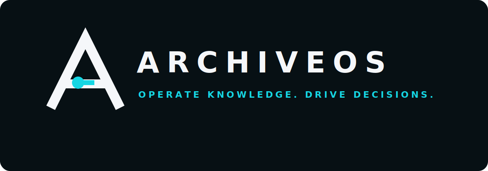

<p align="center">
  
</p>

# ArchiveOS

> **AI 프로젝트를 실행하고 관리하는 차세대 운영 플랫폼**

ArchiveOS는 AI 에이전트, 지능형 RPA, 배치 작업, 워크플로우, 지식 검색과 외부 도구를 하나의 환경에서 실행하고 관제하는 엔터프라이즈 AI 런타임 플랫폼입니다.

사람이 모든 시스템을 직접 운영하는 방식을 넘어, AI가 반복 업무와 운영 분석을 지원하고 사람은 중요한 의사결정과 승인에 집중하는 환경을 지향합니다.

---

## Archive Platform Ecosystem

ArchiveOS can run as the control tower for the Archive Platform ecosystem:

- **Archive-Nexus**: synthetic manufacturing, shipment, maintenance, and quality event outbox.
- **Archive-Logitics**: synthetic logistics route, ETA, delay, and cost event backend.
- **Archive-Ledger**: synthetic transaction, ledger, settlement, reconciliation, and approval callback backend.
- **ArchiveOS**: health aggregation, human approval gate, RAG/fallback policy evidence, audit log, Slack notification, callback outbox, and retry.

ArchiveOS is intentionally loosely coupled. If Nexus, Logitics, or Ledger is not running, ArchiveOS still starts and reports the external service as `UNAVAILABLE`, `UNKNOWN`, or `DEGRADED` through `/api/ecosystem/summary`.

### Ecosystem environment variables

```env
ARCHIVE_ECOSYSTEM_ENABLED=true
ARCHIVE_ECOSYSTEM_REFRESH_TIMEOUT_MS=3000
ARCHIVE_ECOSYSTEM_SERVICES_NEXUS_BASE_URL=http://localhost:8080
ARCHIVE_ECOSYSTEM_SERVICES_LOGITICS_BASE_URL=http://localhost:8092
ARCHIVE_ECOSYSTEM_SERVICES_LEDGER_BASE_URL=http://localhost:18080
ARCHIVE_INTEGRATION_SAFE_MODE=true
ARCHIVE_INTEGRATION_ALLOW_EXTERNAL_WRITE=false
ARCHIVE_INTEGRATION_CALLBACK_ENABLED=true
ARCHIVE_INTEGRATION_CALLBACK_MAX_RETRY_COUNT=5
ARCHIVE_INTEGRATION_CALLBACK_RETRY_DELAY_SECONDS=30
```

When ArchiveOS runs in Docker Compose and external services run on the host, use:

```env
ARCHIVE_ECOSYSTEM_SERVICES_LEDGER_BASE_URL=http://host.docker.internal:18080
ARCHIVE_ECOSYSTEM_SERVICES_LOGITICS_BASE_URL=http://host.docker.internal:8092
ARCHIVE_ECOSYSTEM_SERVICES_NEXUS_BASE_URL=http://host.docker.internal:8080
```

### Ecosystem API

```powershell
curl.exe http://localhost:4000/api/ecosystem/services
curl.exe http://localhost:4000/api/ecosystem/summary
curl.exe http://localhost:4000/api/ecosystem/topology
curl.exe -X POST http://localhost:4000/api/ecosystem/refresh
curl.exe -X POST http://localhost:4000/api/ecosystem/demo/dry-run
```

External write actions such as Nexus generation/publish, Logitics publish, and Ledger callback dispatch are blocked unless `ARCHIVE_INTEGRATION_ALLOW_EXTERNAL_WRITE=true`. The default portfolio-safe mode is read-only/dry-run.

### Ledger approval callback

External approval requests are accepted through `/api/approvals/external`. ArchiveOS records policy evidence, PM/Admin decision, audit trail, and callback outbox state. Ledger remains responsible for transaction, ledger, settlement, and reconciliation state.

---

## 현재 구현 상태

| 영역 | 현재 상태 |
| --- | --- |
| Operator Console | Sidebar 기반 Overview, Agents, Workflows, Knowledge, History, Batch, RPA, Settings 화면 |
| Compatibility Backend | Node/Express 기반 기존 API 호환과 Spring API 위임 |
| AI Runtime | Spring Boot, Spring AI, ChatModel·EmbeddingModel, Spring Batch·RPA 기반 |
| Knowledge & RAG | Obsidian Markdown 동기화, 청크 생성, 임베딩, pgvector 검색, 출처 추적 기반 |
| Data Platform | PostgreSQL + pgvector 로컬 개발 환경 |
| 산업 애플리케이션 | Archive-Nexus 연동을 위한 공통 런타임과 API 경계 구성 |

현재 구현은 개발·검증 단계입니다. 운영 환경에서는 인증, 권한, 비밀정보 관리, 감사 로그와 배포 정책을 추가로 강화해야 합니다.

---

## Vision

> **AI가 일하고, 사람은 설계하고 결정한다.**

ArchiveOS는 특정 산업에 종속되지 않는 공통 AI 실행 환경을 목표로 합니다. 제조, 물류, 지식 관리, 개발 운영과 문서 처리 애플리케이션이 동일한 런타임 위에서 동작할 수 있도록 플랫폼과 도메인 애플리케이션의 책임을 분리합니다.

---

## Core Features

### AI Agent Runtime

- AI Agent 실행 및 생명주기 관리
- LLM, Tool Calling, 실행 문맥과 메모리 관리
- Agent 상태, 근거와 실행 이력 관측
- Multi-Agent 협업 구조 확장 기반

### Workflow & Batch

- Spring Batch 기반 Job·Step 실행
- 워크플로우 상태와 실행 이력
- 재시도, 실패 원인과 승인 대기 상태
- 운영 화면에서 Batch와 Workflow 진행 상황 확인

### Intelligent RPA

- AI 기반 작업 분류와 조치 추천
- Human-in-the-Loop Approval Gate
- 승인·반려 및 실행 이력 기록
- 실패 복구와 재시도 확장 기반

### Knowledge & RAG

- Markdown 문서 수집과 동기화
- 청크 생성과 임베딩 저장
- PostgreSQL·pgvector 기반 벡터 검색
- AI 응답의 근거와 출처 추적

### Operations & Observability

- 시스템 상태와 서비스 Health Check
- Critical Alert와 최근 활동 표시
- Agent, Batch, Workflow, RPA 실행 현황
- Spring Boot 소유 Slack 알림과 외부 운영 도구 연동 기반

---

## Architecture

```text
React Operator Console
  -> Node/Express Operations Backend
       -> archiveos-ai (Spring Boot + Spring AI + Spring Batch)
            -> PostgreSQL + pgvector
            -> Obsidian Markdown Vault
            -> ChatModel / EmbeddingModel
```

```text
ArchiveOS
├── AI Agent Runtime
├── Spring AI
├── Spring Batch
├── Intelligent RPA
├── Workflow Engine
├── RAG Engine
├── Scheduler / Event Bus
├── Observability
└── Project Runtime
    ├── Archive-Nexus
    └── Future Applications
```

Docker frontend의 Nginx는 `/api/*`와 `/health`를 Node backend로 전달하며, 브라우저는 `http://localhost:5173` 단일 origin으로 UI와 API를 사용합니다.

---

## Operator Console

| 메뉴 | 운영 질문 |
| --- | --- |
| Overview | 지금 정상인가, 무엇을 먼저 확인해야 하는가? |
| Agents | 어떤 Agent가 동작 중이고 근거는 무엇인가? |
| Workflows | 작업이 어느 단계이며 사람의 판단이 필요한가? |
| Knowledge | RAG와 운영 지식이 준비되어 있는가? |
| History | 어떤 이벤트와 결정이 기록되었는가? |
| Batch | 어떤 Job이 실행됐고 Step 결과는 무엇인가? |
| RPA | 어떤 작업이 분류됐고 승인 상태는 무엇인가? |
| Settings | 연결, 보안, 버전과 환경이 정상인가? |

Overview는 `System Health → Critical Alerts → Active Agents → Pipeline → Approval → Knowledge → Recent Activity` 순서로 예외와 다음 행동을 우선 표시합니다.

---

## Archive-Nexus

Archive-Nexus는 ArchiveOS 위에서 동작하는 첫 번째 산업 애플리케이션입니다.

- 가상 공장, 생산, 품질, 재고, 물류와 정비 데이터 생성
- 제조 이상 감지와 원인 분석
- AI 조치 추천과 승인 기반 RPA
- ArchiveOS의 Batch, RAG, Agent, Approval과 Observability 활용

ArchiveOS는 공통 AI 런타임을 담당하고, Archive-Nexus는 제조 도메인 로직을 담당합니다.

---

## Tech Stack

### Backend

- Java 21
- Spring Boot / Spring AI / Spring Batch
- Node.js / Express
- PostgreSQL / pgvector

### Frontend

- React
- Vite
- TypeScript

### Infrastructure & Integration

- Docker / Docker Compose
- REST API / Webhook
- Slack / GitHub
- Kubernetes, Prometheus, Grafana, OpenTelemetry 확장 계획

---

## 로컬 실행

```powershell
docker compose up --build -d
docker compose ps
```

| 서비스 | 주소 |
| --- | --- |
| Operator Console | `http://localhost:5173` |
| Node Backend | `http://localhost:4000` |
| Spring AI Runtime | `http://localhost:4100` |
| PostgreSQL / pgvector | `localhost:5432` |

---

## 검증

```powershell
npm run test
npm run build

cd backend
npm run test
npm run typecheck
npm run build

cd ../archiveos-ai
.\gradlew.bat test --no-daemon
.\gradlew.bat bootJar --no-daemon
```

---

## 안전 원칙

- UI는 관측과 의사결정 기록 중심으로 동작합니다.
- secret, webhook, API key, DB password와 로컬 절대 경로를 frontend에 노출하지 않습니다.
- RAG 실패 시 가짜 성공 대신 `degraded` 또는 `unavailable` 상태를 표시합니다.
- 위험 작업은 Approval Gate 이전에 완료 상태로 처리하지 않습니다.
- shell, MCP, Codex와 process control은 명시적으로 허용된 경계 안에서만 실행합니다.

---

## Roadmap

- [x] Sidebar 기반 Operator Console
- [x] Spring AI Runtime 기반
- [x] Spring Batch와 RPA 운영 기반
- [x] PostgreSQL·pgvector 기반 RAG
- [x] Knowledge 동기화와 출처 추적 기반
- [x] Spring Boot 기반 Slack 운영 알림
- [ ] Archive-Nexus 실제 운영 연동 완성
- [ ] Workflow Designer
- [ ] MCP Tool Registry
- [ ] Multi-Agent 협업 고도화
- [ ] 사용자 인증과 역할 기반 권한
- [ ] Kubernetes 배포
- [ ] Plugin SDK
- [ ] Multi-LLM 지원

---

## Brand

> **Operate knowledge. Drive decisions.**

공식 로고는 검은 배경, 기하학적 흰색 `A`, 청록색 결정 노드로 구성됩니다. README, Sidebar와 favicon은 동일한 마크를 사용합니다.

브랜드 자산과 사용 규칙은 [`docs/brand`](docs/brand)를 참고하세요.

---

## 운영 문서

- [Operator Experience UI Architecture](docs/ui/operator-experience.md)
- [Spring AI Engine Architecture](docs/architecture/spring-ai-engine.md)
- [Spring Batch 운영 구조](docs/architecture/spring-batch.md)
- [RPA 승인 흐름](docs/architecture/rpa-approval-flow.md)
- [RAG 점검 흐름](docs/architecture/rag-health-check-flow.md)
- [Developer Guide](docs/operations/developer-guide.md)
- [AX 구현 상태](docs/AX_IMPLEMENTATION_STATUS.md)
- [전체 아키텍처](docs/ARCHITECTURE_FULL.md)

---

## License

라이선스 정책은 프로젝트 운영 방침에 따라 추후 정의합니다.
