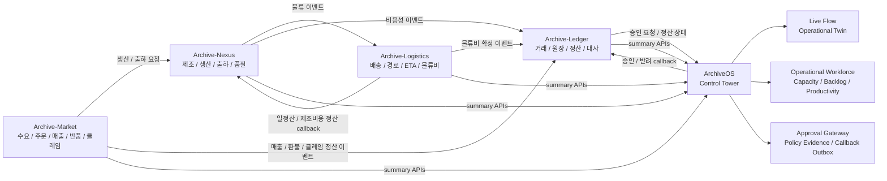
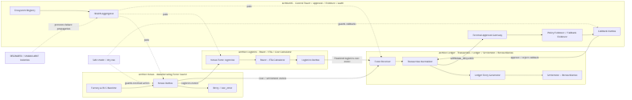

<p align="center">
  
</p>

# ArchiveOS

> 제조, 물류, 정산, 커머스 서비스를 통합 관제하는 Spring Boot 기반 AI/AX Control Tower

ArchiveOS는 Archive Platform Ecosystem의 운영 관제 서비스입니다. Archive-Market, Archive-Nexus, Archive-Logistics, Archive-Ledger를 외부 운영 대상 시스템으로 등록하고, 상태 관제, Live Flow, workforce/capacity 관제, 승인 게이트웨이, 정책 근거, callback outbox, 감사 로그를 통합 관리합니다.

ArchiveOS는 외부 도메인 서비스를 직접 소유하지 않습니다. 각 서비스는 자신의 도메인 데이터를 처리하고, ArchiveOS는 read-only 관제와 승인/감사/정책 근거/운영 제어를 담당합니다. 외부 서비스 장애는 `DEGRADED` 또는 `UNAVAILABLE`로 격리되며 ArchiveOS 런타임 장애로 전파되지 않도록 설계했습니다.

## 핵심 역할

- External System Registry
- Ecosystem Summary / Topology / Timeline
- Live Flow / Operational Twin
- Operational Workforce Overview
- Ecosystem Finance Control
- External Approval Gateway
- Policy Evidence / Fallback Evidence
- Approval Callback Outbox
- Audit Log
- PM Inbox / Daily Report / Slack state-change notification
- Safe-mode 기반 외부 write 차단
- `HEALTHY`, `DEGRADED`, `UNAVAILABLE`, `DISABLED`, `UNKNOWN` 상태 분리

## 연동 서비스

| 서비스 | 역할 | 기본 URL |
| --- | --- | --- |
| Archive-Market | synthetic 수요, 주문, 결제, 매출, 반품, 클레임 이벤트 소스 | `http://localhost:8094` |
| Archive-Nexus | 제조, 생산, 출하, 정비, 품질 이벤트 Outbox | `http://localhost:8080` |
| Archive-Logistics | 배송 경로, ETA, 물류비, 지연, 출하 이벤트 처리 | `http://localhost:8092` |
| Archive-Ledger | 거래, 원장, 정산, 대사, 승인 callback 처리 | `http://localhost:18080` |
| ArchiveOS | Control Tower, 승인, 정책 근거, 감사, 운영 관제 | `http://localhost:5173` |

외부 표시명은 `Archive-Logistics`를 사용합니다. 기존 이벤트/설정 호환성 때문에 일부 내부 key, source, API path에는 `logitics` 또는 `Archive-Logitics` 표기가 남을 수 있습니다.

## Ecosystem Flow



## Archive Project Architecture

<p align="center">
  
</p>

이 이미지는 Archive-Market, Archive-Nexus, Archive-Logistics, Archive-Ledger, ArchiveOS가 로컬 Docker/DB/API 경계 안에서 어떻게 연결되는지 보여주는 전체 구조도입니다. 고해상도 원본과 추가 시퀀스/컴포넌트 다이어그램은 [`docs/diagrams`](docs/diagrams)에 있습니다.

## 주요 API

### Ecosystem

```http
GET  /api/ecosystem/services
GET  /api/ecosystem/summary
GET  /api/ecosystem/topology
GET  /api/ecosystem/timeline
POST /api/ecosystem/refresh
POST /api/ecosystem/demo/dry-run
POST /api/ecosystem/demo/run
```

### Live Flow / Operational Twin

```http
GET  /api/live-flow/summary
GET  /api/live-flow/topology
GET  /api/live-flow/events/recent
GET  /api/live-flow/replay
GET  /api/live-flow/correlation/{correlationId}
GET  /api/live-flow/entity/{entityId}
POST /api/live-flow/refresh
```

Live Flow는 프론트에서 임의로 만든 fake animation이 아니라 Archive-Market, Archive-Nexus, Archive-Logistics, Archive-Ledger, ArchiveOS의 runtime event, outbox, approval, audit, health, callback 데이터를 수집해 정규화한 `Synthetic Runtime Events`를 기반으로 표시합니다.

### Operational Workforce

```http
GET /api/workforce/overview
GET /api/workforce/bottlenecks
GET /api/workforce/recommendations
GET /api/workforce/productivity-trend
```

Workforce 관제는 synthetic workforce/capacity/productivity/cashflow summary만 사용합니다. 실제 직원, 급여, 개인정보는 사용하지 않습니다.

읽는 외부 API:

```http
Market    GET /api/market-workforce/summary
Market    GET /api/market-cashflow/summary
Market    GET /api/market-productivity/summary
Nexus     GET /api/workforce/summary
Nexus     GET /api/productivity/summary
Nexus     GET /api/capacity/summary
Logistics GET /api/workforce/summary
Logistics GET /api/productivity/summary
Logistics GET /api/capacity/summary
Ledger    GET /api/workforce/summary
Ledger    GET /api/productivity/summary
Ledger    GET /api/capacity/summary
```

### Integrations

```http
GET /api/integrations/market/summary
GET /api/integrations/nexus/outbox
GET /api/integrations/logitics/summary
GET /api/integrations/logitics/outbox
GET /api/integrations/logitics/routes
GET /api/integrations/ledger/summary
GET /api/integrations/ledger/approval-required
```

### External Approvals

```http
POST /api/approvals/external
GET  /api/approvals/external
GET  /api/approvals/external/summary
GET  /api/approvals/external/{approvalRequestId}
POST /api/approvals/external/{approvalRequestId}/approve
POST /api/approvals/external/{approvalRequestId}/reject
POST /api/approvals/external/{approvalRequestId}/hold
GET  /api/approvals/callbacks
POST /api/approvals/callbacks/{callbackId}/retry
```

ArchiveOS는 승인 요청, 정책 근거, PM/Admin 결정, 감사 로그, callback outbox 상태를 기록합니다. Ledger는 transaction, ledger, settlement, reconciliation의 source of truth입니다.

## 운영 원칙

- 기본은 read-only 관제입니다.
- 외부 write는 safe-mode와 admin 권한을 통과해야 합니다.
- 기본 설정은 `ARCHIVE_INTEGRATION_SAFE_MODE=true`, `ARCHIVE_INTEGRATION_ALLOW_EXTERNAL_WRITE=false`입니다.
- 외부 서비스가 꺼져 있어도 ArchiveOS는 HTTP 200과 `DEGRADED`/`UNAVAILABLE` 상태를 반환해야 합니다.
- 실제 고객, 결제, 주소, 계좌, 카드, 금융 데이터는 사용하지 않습니다.
- 모든 business sample은 Synthetic Data / Demo Data입니다.
- secret, token, webhook, private key는 UI/API/docs/log/audit metadata에 노출하지 않습니다.

## 실행

```powershell
docker compose up -d --build
docker compose ps
curl.exe http://localhost:5173/api/ecosystem/summary
curl.exe http://localhost:5173/api/ecosystem/topology
curl.exe http://localhost:5173/api/live-flow/summary
curl.exe http://localhost:5173/api/workforce/overview
```

ArchiveOS를 Docker Compose로 실행하고 외부 Archive 서비스가 host에서 실행 중이면 `host.docker.internal` 기반 URL을 사용합니다.

```env
ARCHIVE_ECOSYSTEM_SERVICES_MARKET_BASE_URL=http://host.docker.internal:8094
ARCHIVE_ECOSYSTEM_SERVICES_NEXUS_BASE_URL=http://host.docker.internal:8080
ARCHIVE_ECOSYSTEM_SERVICES_LOGITICS_BASE_URL=http://host.docker.internal:8092
ARCHIVE_ECOSYSTEM_SERVICES_LEDGER_BASE_URL=http://host.docker.internal:18080
```

로컬 bootRun 기준 기본값:

```env
ARCHIVE_ECOSYSTEM_SERVICES_MARKET_BASE_URL=http://localhost:8094
ARCHIVE_ECOSYSTEM_SERVICES_NEXUS_BASE_URL=http://localhost:8080
ARCHIVE_ECOSYSTEM_SERVICES_LOGITICS_BASE_URL=http://localhost:8092
ARCHIVE_ECOSYSTEM_SERVICES_LEDGER_BASE_URL=http://localhost:18080
```

## Smoke Test

```powershell
.\scripts\smoke-ecosystem.ps1
.\scripts\smoke-ecosystem.ps1 -OsApiUrl "http://localhost:5173" -NexusUrl "http://localhost:8080" -LogisticsUrl "http://localhost:8092" -LedgerUrl "http://localhost:18080"
```

기본 smoke는 read-only입니다. `-WriteSmoke`는 외부 서비스 상태를 변경할 수 있으므로 safe-mode, integration enabled, 테스트 데이터 상태를 확인한 뒤 사용합니다.

```powershell
.\scripts\smoke-ecosystem.ps1 -WriteSmoke
```

## 화면

- Overview: 전체 상태, PM Inbox, 주요 metric
- Ecosystem: 서비스 상태, topology, timeline, dry-run
- Live Flow: runtime event 기반 Operational Twin
- Workforce: synthetic workforce, capacity, productivity, bottleneck 관제
- Ecosystem Finance: settlement economy, cashflow, bankruptcy risk 관제
- Ledger Approvals: external approval queue, evidence, callback status
- Agents: 서비스별 agent 상태와 추천
- Workflows / RPA / Batch / Knowledge / Settings: 운영 자동화와 지식 기반 기능

## Internationalization

ArchiveOS UI는 우측 상단 지구본 메뉴에서 표시 언어를 전환할 수 있습니다.

- 지원 언어: 한국어, English, 日本語, 简体中文
- 저장 위치: `localStorage["archive.locale"]`
- fallback: 지원하지 않는 locale은 `ko`
- 번역 대상: 사용자 노출 label, 버튼, empty state, help text, display-only status label
- 번역 제외: API path, eventType, enum value, repository name, service name, traceId, correlationId, command, file path, port

## Architecture

```text
Archive-Market
  ├─ demand / order / payment / revenue event
  ├─ production request → Archive-Nexus
  └─ sales / refund / claim event → Archive-Ledger

Archive-Nexus
  ├─ production / inventory / shipment event
  ├─ logistics event → Archive-Logistics
  └─ cost event → Archive-Ledger

Archive-Logistics
  ├─ route / ETA / logistics cost calculation
  ├─ shipment status / delay / deviation event
  └─ logistics cost event → Archive-Ledger

Archive-Ledger
  ├─ transaction normalization
  ├─ double-entry ledger
  ├─ settlement / reconciliation
  └─ approval callback

ArchiveOS
  ├─ ecosystem summary / topology / timeline
  ├─ live flow / operational twin
  ├─ workforce / bottleneck / recommendation
  ├─ approval gateway / policy evidence
  ├─ callback outbox / retry
  └─ audit / safe-mode / degraded status
```

## 문서

- Architecture: [`docs/architecture.md`](docs/architecture.md)
- Ecosystem Control Tower: [`docs/ecosystem-control-tower.md`](docs/ecosystem-control-tower.md)
- Integration Contracts: [`docs/integration-contracts.md`](docs/integration-contracts.md)
- Live Flow / Operational Twin: [`docs/live-flow-operational-twin.md`](docs/live-flow-operational-twin.md)
- Approval Callback Flow: [`docs/approval-callback-flow.md`](docs/approval-callback-flow.md)
- Policy Evidence: [`docs/policy-evidence.md`](docs/policy-evidence.md)
- Smoke Test: [`docs/smoke-test.md`](docs/smoke-test.md)
- Operations Runbook: [`docs/operations-runbook.md`](docs/operations-runbook.md)
- Diagrams: [`docs/diagrams`](docs/diagrams)
- Screenshots: [`docs/screenshots`](docs/screenshots)

## 검증 명령

```powershell
npm run test
npm run build

cd backend
npm run test
npm run typecheck
npm run build

cd ../archiveos-ai
.\gradlew.bat test --no-daemon --console=plain
.\gradlew.bat bootJar --no-daemon --console=plain

cd ..
docker compose config --quiet
```

## 현재 상태

- Archive-Market / Archive-Nexus / Archive-Logistics / Archive-Ledger 관제 등록
- Market, Nexus, Logistics, Ledger가 꺼져 있어도 ArchiveOS 런타임 유지
- Live Flow / Operational Twin API와 화면 구현
- Operational Workforce API와 화면 구현
- External Approval Gateway와 Callback Outbox 구현
- Policy Evidence / Fallback Evidence 구조 구현
- i18n 언어 전환기와 UI 번역 구조 구현
- safe-mode 기본 차단 유지

## 정리

Archive Platform Ecosystem은 Archive-Market, Archive-Nexus, Archive-Logistics, Archive-Ledger, ArchiveOS를 연결해 외부 수요, 제조 이벤트 생성, 물류 경로와 비용 계산, 금융성 원장과 정산, 승인과 정책 근거, 장애 관제를 하나의 이벤트 드리븐 AX 백엔드 흐름으로 구현한 Java/Spring 기반 프로젝트입니다. 각 서비스는 Outbox, idempotency, retry, safe-mode, DEGRADED 상태 분리를 통해 외부 장애가 전체 런타임으로 전파되지 않도록 설계했습니다.
