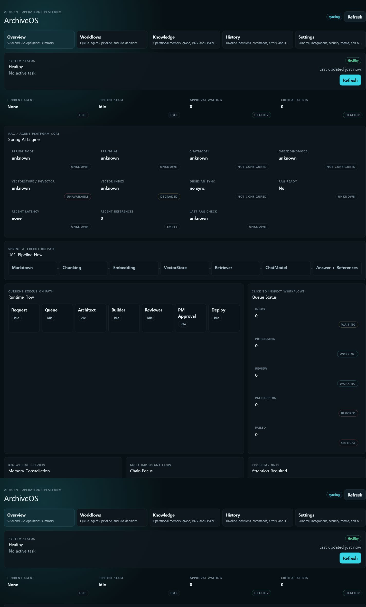
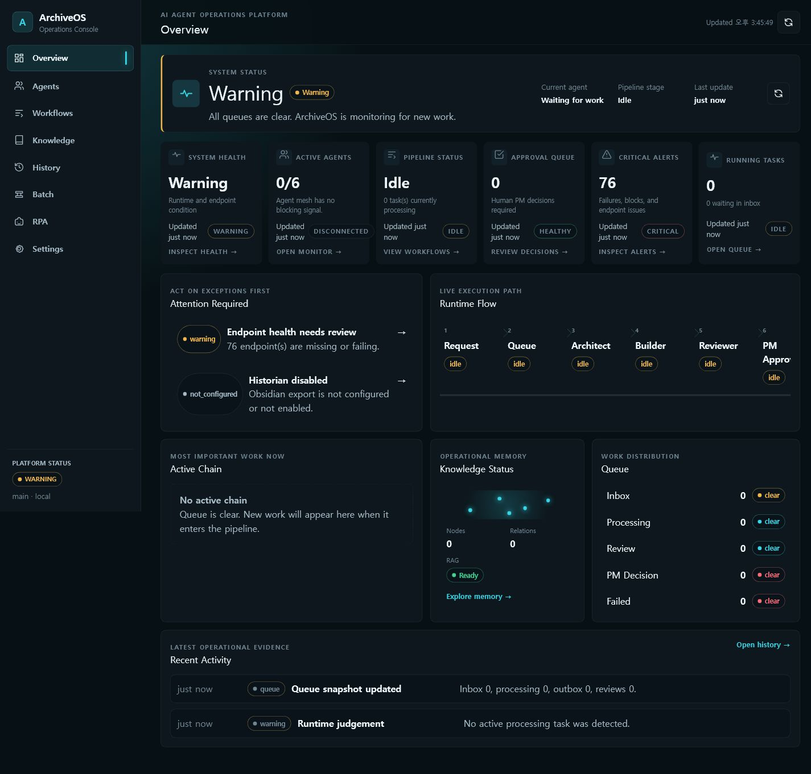
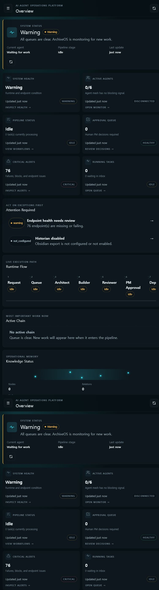

# ArchiveOS Operator Experience UI Architecture

## 목표

ArchiveOS의 첫 화면은 기능 목록이 아니라 운영 판단 화면이다. 운영자는 3초 안에 시스템 상태, 현재 작업, 병목, 승인 필요 여부를 확인하고 1초 안에 관련 상세 화면으로 이동할 수 있어야 한다.

## Information Architecture

```text
Operator Console
├─ Overview    상태, 경고, Pipeline, 승인, Queue, Knowledge 요약
├─ Agents      Agent 역할, 현재 상태, 최근 handoff
├─ Workflows   Queue, Runtime Flow, PM Decision
├─ Knowledge   Memory, Graph, RAG, Obsidian
├─ History     Event, Command, Decision, Error, KPI
├─ Batch       Spring Batch Job, Execution, Step, Context
├─ RPA         Task Classification, Risk, PM Decision History
└─ Settings    Runtime, Integration, Security, Theme, Build
```

기존 상단 탭은 좌측 Sidebar로 변경했다. 선택한 메뉴는 accent bar, border, background로 동시에 표시하며 `aria-current="page"`를 제공한다. 820px 이하에서는 Sidebar를 숨기고 명시적인 메뉴 버튼으로 연다.

## Component Structure

```text
src/
├─ app/
│  ├─ AppShell.tsx
│  └─ navigation.ts
├─ pages/
│  ├─ OverviewPage.tsx
│  ├─ AgentsPage.tsx
│  ├─ WorkflowsPage.tsx
│  ├─ KnowledgePage.tsx
│  ├─ HistoryPage.tsx
│  ├─ BatchPage.tsx
│  ├─ RpaPage.tsx
│  └─ SettingsPage.tsx
└─ components/shared/
   ├─ Sidebar.tsx
   ├─ Button.tsx
   ├─ Icon.tsx
   ├─ MetricCard.tsx
   ├─ SectionCard.tsx
   └─ StatusBadge.tsx
```

`AppShell`은 데이터 수집과 화면 조립만 담당한다. `Sidebar`, `MetricCard`, `StatusBadge`, `Icon`은 페이지 간 동일한 상호작용과 시각 언어를 제공한다.

## Design Decisions

### 1. 예외 우선

Overview는 아래 순서를 따른다.

1. System Health
2. Critical Alerts
3. Active Agents
4. Pipeline Status
5. Approval Queue
6. Knowledge Status
7. Recent Activity

정상 상태를 여러 카드에 반복하지 않는다. `Attention Required`에는 실패, 차단, 승인, 연결 문제만 최대 5개 표시한다.

### 2. KPI는 상세 화면의 입구

6개 KPI Card는 icon, 현재 값, 설명, 상태, 갱신 시각, quick action을 포함한다. Card 전체가 button일 때 hover, pointer, focus ring, transition을 제공한다.

### 3. 상태 언어 통일

`StatusBadge`가 runtime 원본 값을 다음 semantic state로 정규화한다.

- Healthy / Success
- Warning / Degraded / Stale
- Critical / Failed / Blocked
- Running / Working
- Idle / Waiting / Initializing
- Disconnected / Not Configured / No Data Yet

원인을 알 수 없는 값도 사용자에게 `Unknown`으로 그대로 노출하지 않고 `Waiting for data`로 처리한다.

### 4. 상태 색상은 의미 전달에만 사용

기본 surface는 neutral이고 cyan은 active/navigation, green은 healthy, amber는 warning, red는 critical에만 사용한다. 모든 색은 기존 semantic CSS token을 재사용한다.

### 5. 반응형과 접근성

- 1440px: 고정 Sidebar + 12-column content grid
- 1180px 이하: KPI 3열, Agent 2열
- 820px 이하: Drawer Sidebar, KPI 2열, 상세 영역 1열
- 520px 이하: KPI와 Card 1열
- 360px에서 문서 폭과 viewport 폭이 동일함을 브라우저로 검증
- 모든 click target은 button 또는 keyboard-focusable element 사용
- active navigation은 `aria-current`, 메뉴는 `aria-expanded`, icon은 장식 요소로 처리

## Before / After

### Before

상단 5개 탭에 긴 설명이 반복되고 Dashboard에 Spring AI 상세와 운영 요약이 동일한 계층으로 노출됐다.



### After

Sidebar에서 목적지를 명확히 분리하고, Overview의 첫 viewport를 System Status와 6개 운영 KPI 중심으로 재구성했다.



태블릿에서는 2열 KPI와 Drawer Sidebar를 사용한다.



## UX 개선 결과

- Dashboard와 상세 업무 화면의 책임을 분리했다.
- Agent, Batch, RPA를 별도 목적지로 제공해 탐색 비용을 낮췄다.
- Workflows의 중복 Batch/RPA 섹션을 제거했다.
- 상태, hover, focus, active 표현을 공통 컴포넌트로 통일했다.
- 연결되지 않은 서비스는 healthy로 추정하지 않고 Offline/Disconnected로 표시한다.
- tablet 및 360px에서 가로 overflow를 제거했다.

## 향후 확장 방향

1. `Ctrl+K` Command Palette를 read-only navigation/search 용도로 추가
2. Critical Alert를 모으는 Notification Center 추가
3. 실시간 metric stream과 threshold 기반 운영 trend 추가
4. Archive Nexus와 token/component package 공유
5. Workflow, Agent, Knowledge node 간 deep link 표준화

## 검증 기준

- Sidebar 목적지 8개 및 active highlight
- Overview KPI 6개와 Runtime Flow
- Agent Monitor, Batch, RPA 독립 화면
- 1440px/768px/360px 가로 overflow 없음
- keyboard focus 및 ARIA navigation contract
- Light/Dark/System semantic token 유지
- frontend/backend/archiveos-ai 기존 test/build 통과
